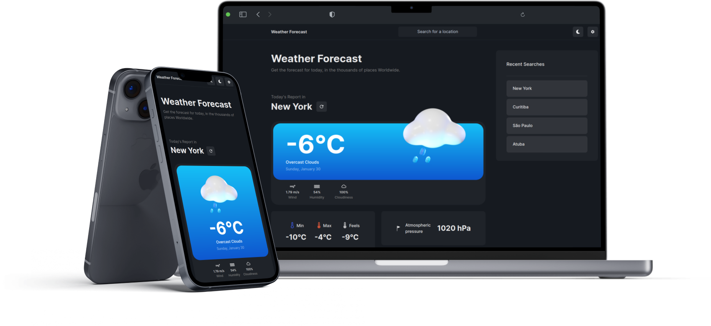

# Weather App

## Welcome! 👋

Thanks for checking out this web development code challenge.

Check this application in

https://weather-app-three-psi.vercel.app/

## The challenge

The challenge is to build an application that consumes the user's current location and displays the current address, weather data for the region and a button to update the data in the interface.

## How to use the app

Step 1 - Make a clone of the application, access the folder where it is located and enter the application;

Step 2 - Install the project's dependencies using the `yarn install` command;

Step 3 - To use the application, you must first create an `.env` file at the root of the website to configure the application's environment variables, copy the variables from env.example and replace the necessary values;

Step 4 - To start the application in the development environment, run the `yarn dev` command. The application will start running on your localhost;

Step 5 - To build your application, run the command `yarn build` and then `yarn preview`.

## Building the project
